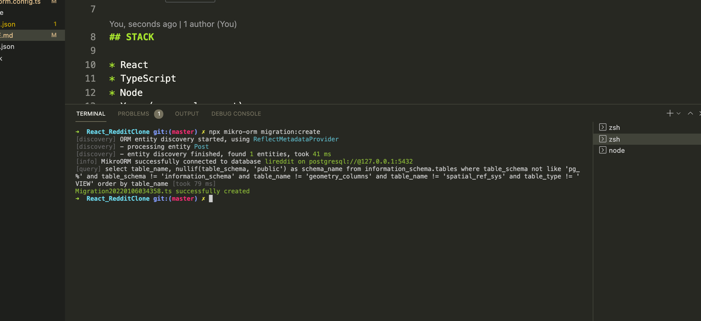
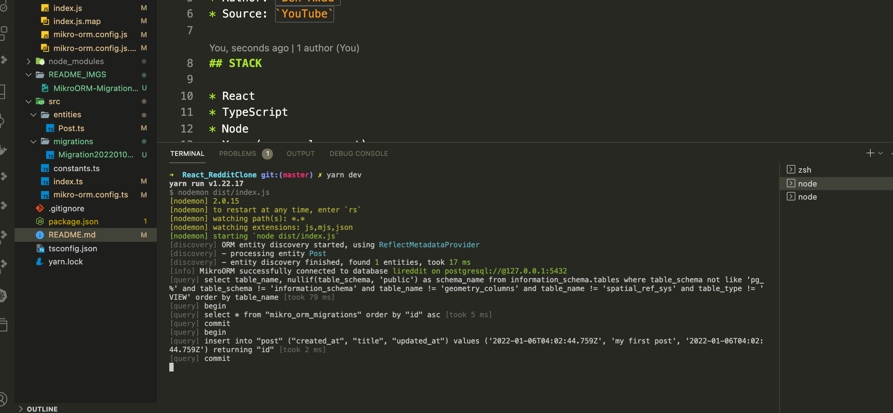
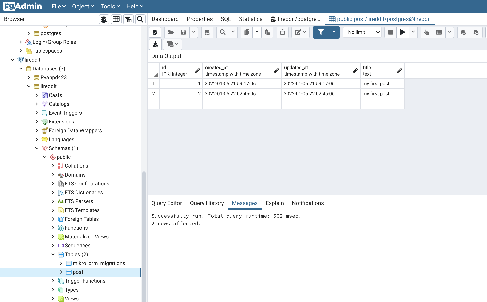
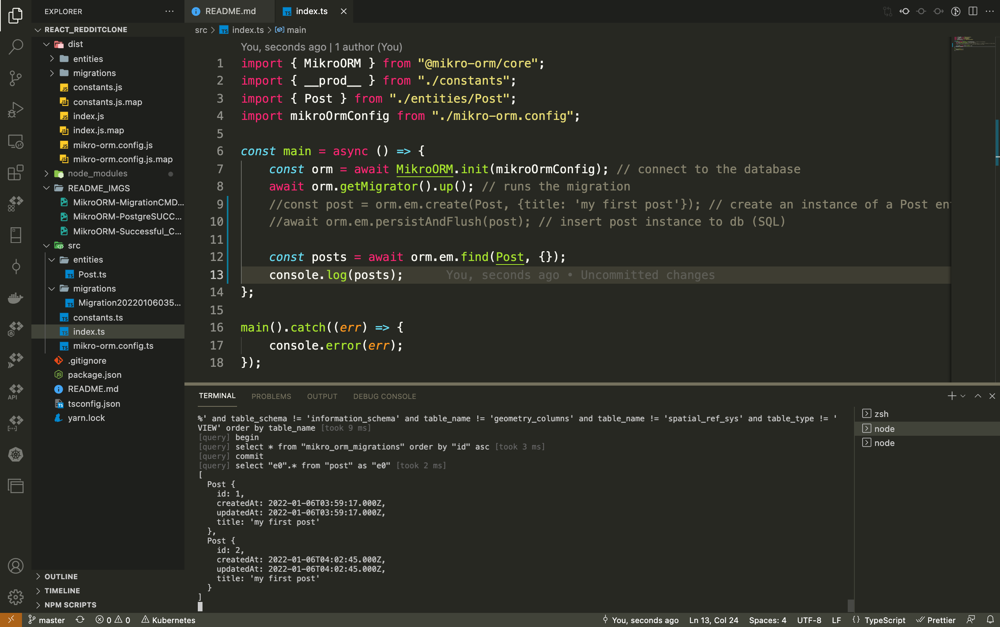
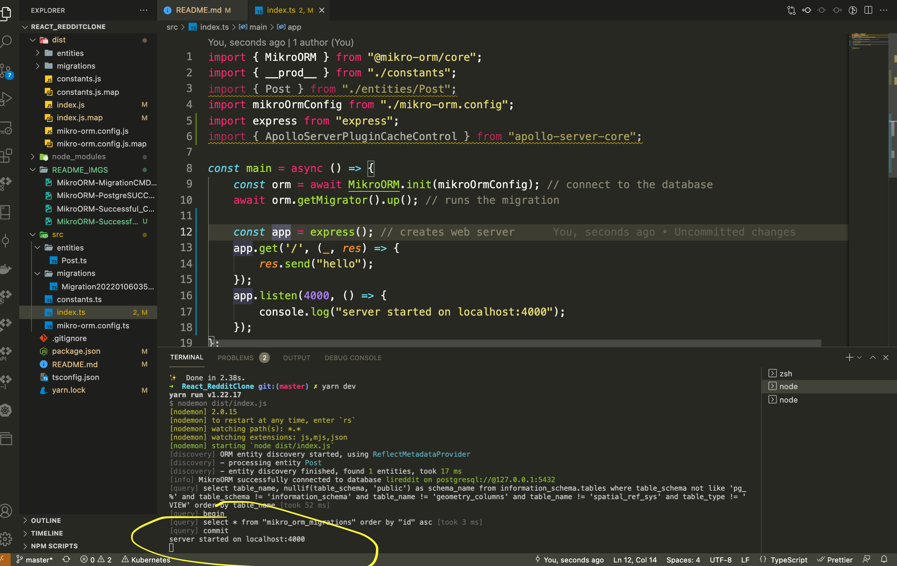
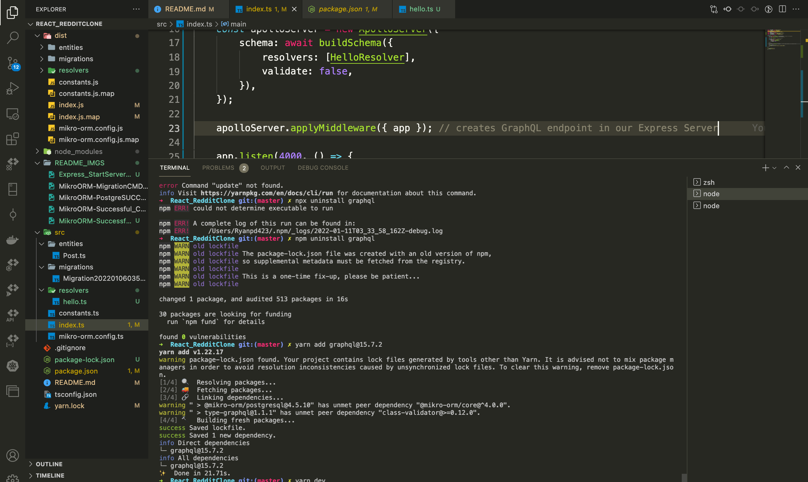
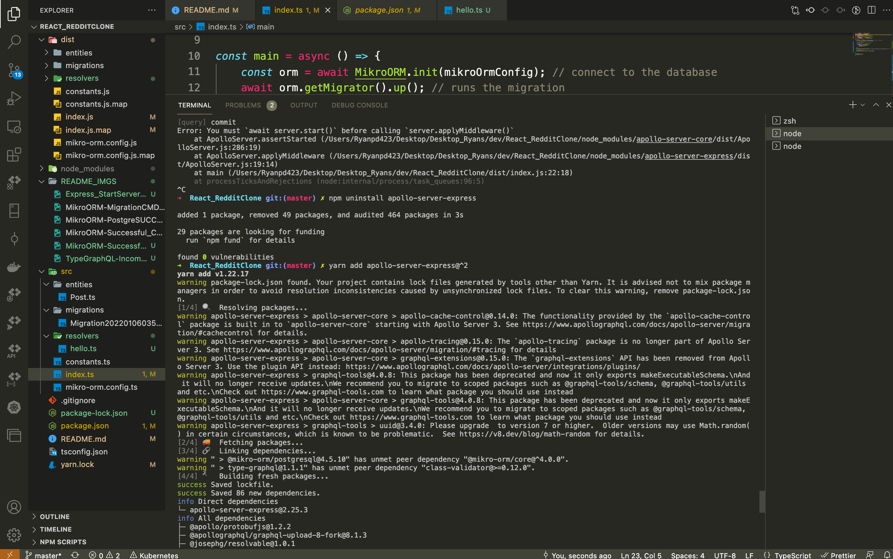
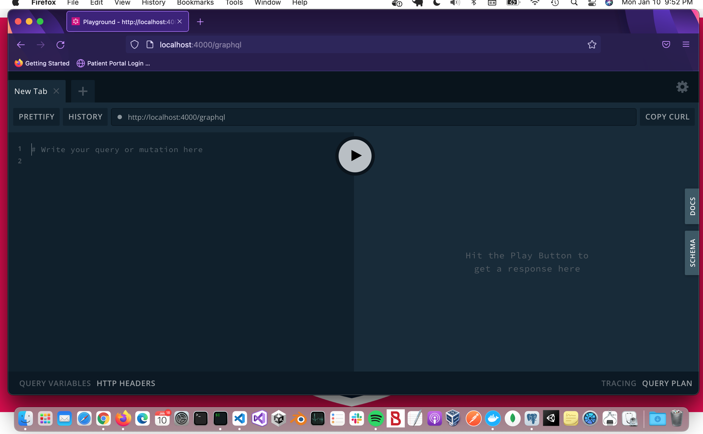
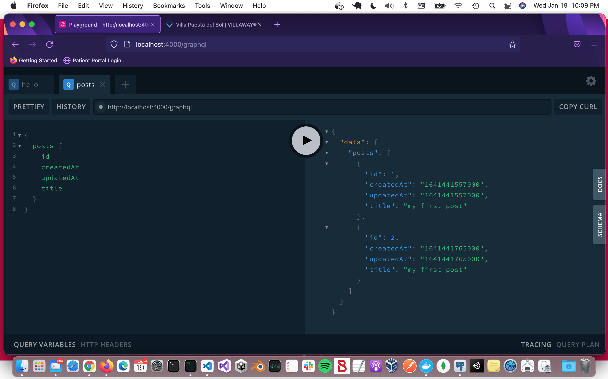

# Fullstack React GraphQL Typescript Tutorial

* Continue @ `56:26`

* Author: `Ben Awad`
* Source: `YouTube`

## STACK

* React
* TypeScript
* Node
* Yarn (npm replacement)
* Visual Studio Code (see Extensions)
* MikroORM
* PostgreSQL
* TypeGraphQL

### NPM / YARN / NPX / NODE / NODEMON
* `yarn dev` - The ts-node package allows you to run your TypeScript code directly without compiling it to JavaScript. It’s like the node executable but for .ts files.
* * Run in a separate node terminal
* `yarn watch` creates the `dist\` dir when it compiles your typescript into javascript
* * Run in a separate node terminal
* * * `MikroORM` will not delete old migration files from here so you will want to delete the `dist` dir then run `yarn watch` from another node terminal so that a fresh one is created

### MikroORM
* Migrations Cmd via CLI: `npx mikro-orm migration:create` 
  * Creates new migration with current schema dif
* Successful Cmd Output From Node-1 (`yarn dev`): 
* Successful Cmd Output From Node-2 (`yarn dev`) 
* Confirm in PGAdmin4 (`postgresql`) 
* Query Database 

### Express (server) / Apollo-Server-Express / GraphQL / Type-GraphQL
* `yarn add express apollo-server-express graphql type-graphql`
* * express = server (middleware)
* * apollo server express allows to use graphql and create a graphql endpoint very easily and then use type-graphql for our schema - Ben Awad
* `yarn add -D @types/express` -- have to install the types for express, the others just work with typescript OOTB
* Start Server: `yarn dev`
* * Server Output 

* **ERROR**: Incompatible Version `Type-GraphQL` - FIX: 
* * * `https://stackoverflow.com/questions/69957128/incompatible-versions-of-graphql-and-typegraphql`
* **ERROR**: Incompatible Version `Apollo-Server-Express` - FIX: 
* * * `https://stackoverflow.com/questions/68354656/unhandledpromiserejectionwarning-error-you-must-await-server-start-before`
* `GraphQL Playground` @ `localhost:4000/graphql` 

* **ERROR: Cannot find module (or something to this effet)**: Look to the import statement of the file it supposedly cannot find and use relative pathing if explicit pathing is being used.  What fixed this issue for me was changing `src\entities\Post` to `..\entities\Post`

* If you have successfully added the new Posts Resolver (as of `56:00`) then you should be able to do the following in your GraphQL playground:
* `GraphQL Playground - Posts`: 